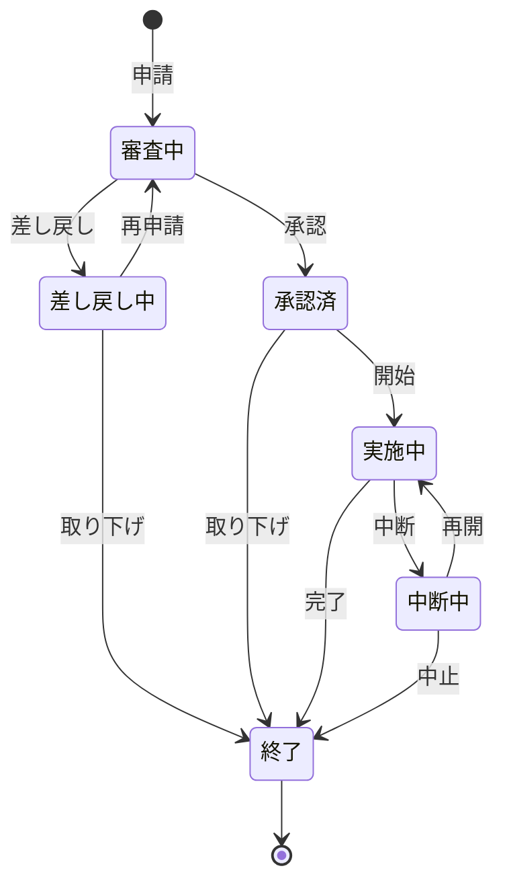

## 概要
本の気づき等を適当に記述していく。
今後開発する中での規約につなげられたらいいなあ。


### 目的
変更容易性を向上させ、ビジネスの変化に対応していくこと。
バグが発生しづらい仕組みを構築し、運用保守の割合を減らすこと

### 変更が大変なプログラムとは
- メソッドが長い、クラスが大きい、引数が大きい
- メソッドが長い：理解するのが大変。if-elseが入った改修には骨が折れる
- クラスが大きい：関心事を詰みこみすぎ。ある改修がどこに影響を及ぼすのかがわからなくなる
- 引数が大きい：関心事を詰みこみすぎ。どの引数がある変更に影響するのかがわかりづらく、メソッドも長くなる。
　　　　　　　if文も増え、メソッドが長くなるとクラスも大きくなる。

## 1章 -小さくまとめてわかりやすくする-

**重要**
> - 名前は略語ではない普通の単語を使用
> - 数行のコードを意味のある単位として「段落」を分ける
> - 「目的別の変数」を使う(1つの変数を使いまわさない)
> - 意味のあるコードのまとまり「段落」を「メソッド」として独立させる
> - 業務の関心事に対応したクラス(ドメインオブジェクト)を創る
> - 短いメソッド、小さなクラスを使ってコードを整理
> - 値オブジェクトでわかりやすく安全に
> - コレクションオブジェクトで、複雑なロジックを集約して整理
> - クラス、メソッド名と業務の用語が一致するほど、プログラムの意図がわかりやすくなる

### 命名規則
- 略すな(ユビキタス言語)。業務で使用する言葉をそのまま使おう。
- quantityをqty、unitPriceをup、ましてやa,b,cの変数名はいろいろな解釈が生まれるリスクがある。 

- 目的が異なる変数を同じにしないこと。破壊的代入と呼ばれる。

```java
int price = quantity * unitPrice;

if(price < 3000>){
    price += 500;//送料
}

price = price * taxRate();
```

これだとpriceが送料にも使われてるし、税込み金額にも使用されている。
次のように表現することが望まれる。
説明用の変数の導入と呼ぶ。

```java
int basePrice = quantity * unitPrice;

int shippingCost = 0;
if(basePrice < 3000>){
     shippingCost = 500;//送料
}

int itemPrice = 0;
itemPrice = (basePrice + shippingCost) * taxRate();
```

### メソッドの書き方
- 長いメソッドは「段落」に分けて読みやすく

```java
int price = quantity * unitPrice;

if(price < 3000>){
    price += 500;//送料
}

price = price * taxRate();
```

### メソッドの抽出
 - 段落ごとに説明用変数を用意する
 - 呼び出し元がシンプル、メソッド内に変更の影響を閉じ込められる、

```java
int basePrice = quantity * unitPrice;

int shippingCost = shippingCost(basePrice);

int itemPrice = (basePrice + shippingCost) * taxRate();
```
 - 異なるクラスで共通のロジックを呼び出す場合は、p23参考。
- 今回の場合は、ShippingCost(送料)クラスを作成
- 送料はこのクラスでのみ扱う。このように業務で使われる言葉に合わせて作成されるクラスを**ドメインオブジェクト**と呼ぶ。

- メソッドの中身の書き方(オブジェクト設計スタイルガイド)

```
メソッド実装の5つのコツ
事前条件のチェック
失敗のシナリオ
ハッピーパス
事後条件のチェック
voidもしくは特定の方の値を返却
```


### 値オブジェクト

#### 技術背景
- なんでもかんでも基本データ型は乱暴
- intは-21億～+21億を扱うが、業務でほんとにその値を扱うのか？
- Stringも同様に、無限の文字列を扱うことはない。
- そのような値を扱うための専用のクラスを作成する必要がある(値オブジェクト)

#### メリット
- 業務的に不適切な値の混入を防ぐ
- 業務ルール変更時においても、変更の影響範囲も型のクラス内に閉じ込めやすい
- よく使用する値オブジェクト一覧はp33に記載。
- 処理の途中で値が変わることを心配しなくてよい

#### 注意事項
- イミュータブル(不変)にする
 - 変数の値の上書きは危険。値が異なるのであれば別オブジェクトにすべき。

```java
Money basePrice = new Money(3000);
Money discounted = basePrice.minus(1000);
Money option = new Money(1000);
```

### コレクションオブジェクト(ファーストクラスコレクション)

#### 技術背景
> 配列やコレクションはコードを複雑にします
 - for文などループ処理のロジック
 - 配列やコレクションの要素の数が変化
 - 個々の要素の内容が変化する
 - ゼロ件の場合の処理
 - 要素の最大数制限

> コレクションの要素を追加、要素を削除、要素を書き換えるを複数の処理で実施すると
> 期待した動作にならなかったり、副作用が起きやすい。

```java
class Customer{
    List<Customer> customers;

    void add(Customer customer){...}
    void removeIfExist(Customer customer){...}
}
```

#### メリット
- 値オブジェクト同様に、データとロジックを閉じ込めることで、使う側が単純に

#### 注意事項
- イミュータブル(不変)にする
 - getListなどのそのまま返すメソッドはNG。要素が勝手に登録される恐れがある。

---

## 第2章 -場合分けのロジックを整理する-

### 区分や種別がコードを複雑に

- 顧客区分
- 料金種別
- 商品分類
- 地域区分
- 製品タイプ

区分があるとif/switch文が増えるが、同じような分岐があちこちに登場すると、プログラム変更をやりにくくする。

#### 区分ごとの整理方法

- コードの塊は、メソッドとして抽出して独立させる
- 関連するデータとロジックは、１つのクラスにまとめる


悪い例
```java
if(customerType.equals("child")){
    fee = baseFee * 0.5;
}
```

良い例
```java
if(isChild()){
    fee = childFee();
}

//判断ロジックの詳細
private Boolean isChild(){
    return customerType.equals("child");
}
```

- else句をなくすと条件分岐が単純に

良い例
早期リターンする書き方をガード節と呼ぶ。
```java
Yen fee(){
    if(isChild() return chiledFee();
    if(isSenior()) return seniorFee();
    if(isAdultFee()) return adultFee();
}
```
#### メリット
- 順番を入れ替えてもうまくいく、疎結合。
- 見やすい、追加もしやすい

#### さらに独立性を高める(p53)
- 区分ごとのロジックを別のクラスに分けて記述する
- AdultFee,ChildFee,SeniorFeeクラスのように
- 区分ごとのロジックがわかりやすくなるので、どこに何が書いてあるのかがわかりやすい。

#### 問題
- クラスを使う側は、AdultFee,ChildFeeのクラスを意識して使う必要がある。
- そうなると呼ぶ出す側は、if分を書く必要があり、メリットが失われる。

#### 解決策
- インターフェースを使う
- これを多態と呼ぶ。

```java
interface Fee(){
    Yen fee();
    String label();
}

class Reservation{
    List<Fee> fees;

    Reservation(){
        fees = new ArrayList<Fee>();
    }

    void addFee(Fee fee){ //大人でも子供でも追加可能
        fees.add(fee);
    }

    Yen feeTotal(){
        Yen total = new Yen(0);
        for(Fee each : fees){
            total.add(each.fee());
        }
        return total;
    }
}

```

### 区分オブジェクト

```java
enum FeeType{
    adult(new AdultFee()),
    child(new ChildFee()),
    senior(new SeniorFee());

    private Fee fee;

    FeeType(Fee fee){
        this.fee = fee;
    }

    Yen fee(){
        return fee.fee();
    }

    String label(){
        return fee.label();
    }
}

Yen feeFor(String feeTypeName){
    FeeType feeType = FeeType.valueOf(feeTypeName); //例えば、adult
    return feeType.fee();
}

```

#### 区分/分類/種別への対応

業務要件として区分を見つけたら、とりあえずEnum型で定義
区分ごとの名称や値を、それぞれの列挙要素のコンストラクタとして指定。
区分ごとに判断/加工/計算のロジックが異なる場合は区分ごとのクラスを作成する
業務ロジックの複雑さは、ほとんどの場合、区分や区分の組み合わせに関連。

### 状態遷移への対応



#### 状態を列挙する
```java
 Enum State{
    審査中,
    差し戻し中,
    承認済,
    実施中,
    中断中,
    終了
 }

 State[] states = State.values();//状態の一覧
 Set nextStates = EnumSet.of(State.承認済,State.差し戻し中); //状態のグルーピング
```

- ある状態から遷移可能な状態をSetで宣言する
- 遷移元の状態を「キー」に、遷移可能な状態のSetの値(バリュー)にしたMapを宣言する

```java
 class StateTransitions{
    Map<State,Set<State>> allowed;

    {
        allowed = new HashMap<>();
        allowed.put(State.審査中, EnumSet.of(State.差し戻し中));
        allowed.put(State.差し戻し中, EnumSet.of(State.審査中,State.終了));
        allowed.put(State.承認済, EnumSet.of(State.実施中,State.終了));
    }

    boolean canTransit(State from, State to){
        Set<State> allowedStates = allowed.get(from);
        return allowedStates.contains(to);
    
    }
}
```

**重要**


#### 中項目

**協調**

- 箇条書き
  - 箇条書き
